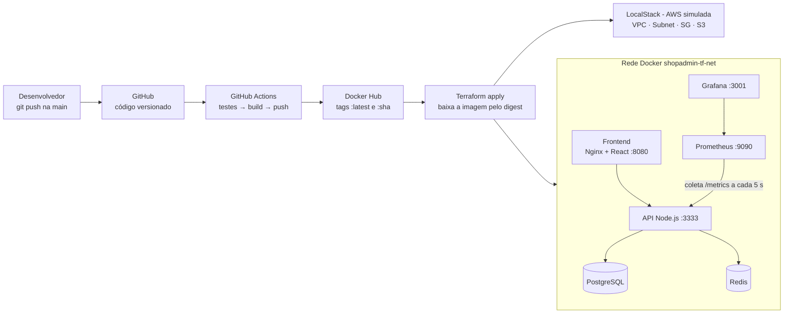

# ShopAdmin — Infraestrutura Moderna e Observabilidade

[](https://github.com/MatheusB-dev77/projeto-devops-aponti/actions/workflows/ci-cd.yml)

Projeto do **Desafio Prático Final de DevOps**: uma esteira automatizada que leva cada alteração de código da `main` até a aplicação no ar, com a infraestrutura descrita como código e a saúde da aplicação visível em tempo real.

A aplicação é o **ShopAdmin**, um painel de e-commerce com API Node.js/Express (PostgreSQL + Redis) e frontend React.

---

## Arquitetura



## Tecnologias e papel de cada uma

| Ferramenta | Papel no projeto | Benefício |
| --- | --- | --- |
| **Git + GitHub** | Versiona aplicação, pipeline, infraestrutura e monitoramento | Rastreabilidade e rollback |
| **Docker** | Imagens multi-stage da API e do frontend (Nginx) | Mesmo pacote em qualquer ambiente |
| **Docker Hub** | Registro público das imagens | Distribuição das versões |
| **GitHub Actions** | Testes, build e push automáticos a cada push na `main` | Velocidade e menos erro humano |
| **Terraform** | Provisiona a rede/armazenamento na AWS (LocalStack) e os containers | Infra reproduzível e revisável |
| **LocalStack** | Simula a AWS localmente | Testar IaC sem custo de nuvem |
| **Prometheus** | Coleta as métricas da API | Histórico de saúde da aplicação |
| **Grafana** | Dashboard em tempo real | Problemas visíveis antes do cliente |

## Estrutura do repositório

```
.
├── .github/workflows/ci-cd.yml     # Pipeline: testes → build → push
├── api/                            # API Node.js (Express, PostgreSQL, Redis)
│   ├── Dockerfile                  # Multi-stage, usuário sem root, healthcheck
│   └── src/middlewares/metrics.js  # Métricas para o Prometheus (/metrics)
├── frontend/                       # React (Vite)
│   ├── Dockerfile                  # Multi-stage: build com Node, serve com Nginx
│   └── nginx.conf                  # Repassa /api para a API e serve o SPA
├── terraform/                      # Infraestrutura como código
│   ├── versions.tf                 # Providers AWS (LocalStack) e Docker
│   ├── variables.tf
│   ├── network.tf                  # VPC, Subnet, Security Group, S3
│   ├── app.tf                      # Postgres, Redis, API, Frontend
│   ├── monitoring.tf               # Prometheus e Grafana
│   └── outputs.tf
├── monitoring/
│   ├── prometheus/prometheus.yml
│   └── grafana/provisioning/       # Datasource + dashboard provisionados
└── docker-compose.yml              # Stack completa para testes locais
```

## Pré-requisitos

- Docker Desktop
- Terraform 1.6 ou superior
- Node.js 22 (apenas para rodar a API ou o frontend fora do Docker)

## Como executar

### Opção 1 — Docker Compose (teste local rápido)

```bash
docker compose up -d --build
docker compose exec api npm run seed
```

Acesse http://localhost:8080.

### Opção 2 — Terraform + LocalStack (ambiente completo)

```bash
# 1. AWS simulada (versão fixada: a "latest" exige token desde 03/2026)
docker run -d --name localstack -p 4566:4566 localstack/localstack:4.4.0

# 2. Infraestrutura + aplicação + monitoramento
cd terraform
terraform init
terraform apply -var "image_tag=$(git rev-parse HEAD)"

# 3. Dados de exemplo
docker exec tf-shop-api npm run seed
```

O `image_tag` com o SHA do commit faz o Terraform baixar do Docker Hub exatamente a imagem que a pipeline publicou para aquele commit. Sem a variável, ele usa `latest`.

## Endereços

| Serviço | URL |
| --- | --- |
| Frontend | http://localhost:8080 |
| API — saúde | http://localhost:3333/health |
| API — métricas | http://localhost:3333/metrics |
| API — documentação (Swagger) | http://localhost:3333/api-docs |
| Prometheus | http://localhost:9090/targets |
| Grafana (`admin` / `admin`) | http://localhost:3001 |
| LocalStack | http://localhost:4566/_localstack/health |

## Pipeline CI/CD

Disparada a cada push na `main` (ou manualmente pela aba **Actions**):

1. **Testes da API** — `npm ci` + `npm run test:unit` (Jest). Se falhar, nada é publicado.
2. **Build e Push** — gera `ecommerce-api` e `ecommerce-frontend` em paralelo e publica no Docker Hub com duas tags: `latest` e o SHA do commit.

Secrets necessários em **Settings → Secrets and variables → Actions**:

| Secret | Valor |
| --- | --- |
| `DOCKERHUB_USERNAME` | Usuário do Docker Hub |
| `DOCKERHUB_TOKEN` | Personal Access Token com permissão Read & Write |

Imagens publicadas: [hgdcghsvf/ecommerce-api](https://hub.docker.com/r/hgdcghsvf/ecommerce-api) · [hgdcghsvf/ecommerce-frontend](https://hub.docker.com/r/hgdcghsvf/ecommerce-frontend)

## Observabilidade

A API expõe em `/metrics`:

- métricas padrão do Node.js: CPU, memória, event loop, garbage collector;
- `http_requests_total`: contador por método, rota e status;
- `http_request_duration_seconds`: histograma do tempo de resposta.

O dashboard **"ShopAdmin - API em tempo real"** já vem provisionado no Grafana, com requisições por segundo (total e por rota), tempo de resposta p50/p95/p99, taxa de erros 5xx, status da API, CPU, memória e respostas por status HTTP.

Para gerar tráfego e ver os gráficos se mexendo (PowerShell):

```powershell
1..300 | ForEach-Object { curl.exe -s -o NUL http://localhost:8080/api/v1/products; Start-Sleep -Milliseconds 100 }
```

## Segurança e confiabilidade

- Credenciais do Docker Hub em GitHub Secrets, nunca no código.
- Containers da API rodando como usuário sem privilégios (`node`).
- PostgreSQL e Redis sem portas expostas: só a API acessa, pela rede interna.
- Security Group liberando apenas as portas 80 e 3333.
- Helmet e rate limit na API; `/metrics` fica fora do limitador.
- Nenhuma imagem é publicada sem os testes passarem.
- Cada deploy aponta para uma versão imutável (SHA do commit). Rollback:

```bash
terraform apply -var "image_tag=<sha-do-commit-anterior>"
```

## Comandos úteis

| Comando | Para quê |
| --- | --- |
| `terraform plan` | Ver o que vai mudar antes de aplicar |
| `terraform output` | IDs da VPC, subnet, SG e URLs |
| `terraform destroy` | Remover toda a infraestrutura |
| `docker ps` | Conferir os containers `tf-shop-*` |
| `docker logs tf-shop-api` | Logs da API |

> As senhas deste repositório (`ecommerce123`, `admin`) são apenas para ambiente local de estudo.

---

Desenvolvido por **Matheus Batista** · [GitHub](https://github.com/MatheusB-dev77)
